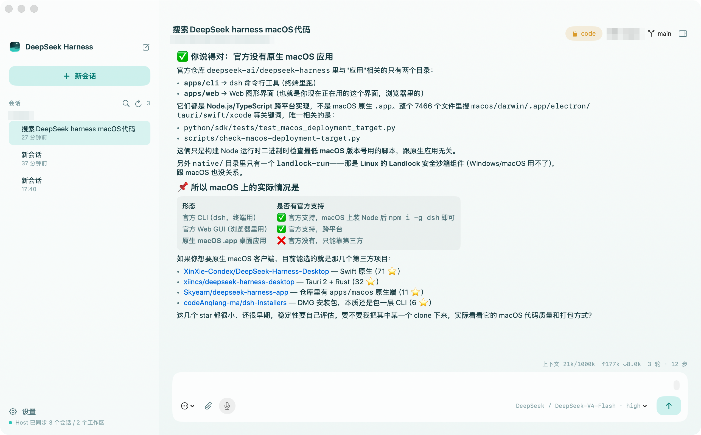

# DeepSeek Harness — Native macOS App

[English](README.md) | 中文

[](https://github.com/luochenw/deepseek-harness-macos/actions/workflows/ci.yml)
[](https://github.com/luochenw/deepseek-harness-macos/releases/latest)
[](LICENSE)


这是一个独立的、**非官方**的 SwiftUI/AppKit 原生 macOS 客户端，面向 [DSH](https://github.com/deepseek-ai/deepseek-harness)（DeepSeek Harness）——不是 WebView 或 Electron 包装器，也与 DeepSeek AI 官方无关联、未经其认可。界面、工作区选择、会话视图、输入编辑器、运行状态、文件夹操作、设置面板、菜单栏和系统通知都由 macOS 原生 API 实现。

Agent 推理、工具、MCP、终端、文件系统与子代理仍由 DSH runtime 提供。App 内置 Node.js 和完整 DSH runtime，运行时不依赖系统已安装的 node 或 dsh。



## 原生功能

- SwiftUI 原生三栏界面、流式输出、运行/停止状态与键盘快捷键。
- NSOpenPanel 原生工作区入口；已选工作区持久化在 macOS 用户偏好中。
- 本地任务从所选工作区启动，DSH 可执行终端、读取/修改文件、使用技能及配置好的本地工具。
- 子代理会话是叠加在对话面板上的独立、实时流式视图（而非插入侧边栏的伪顶层会话），带只读/可续写的可视区分与面包屑导航。
- 常驻菜单栏图标 + 系统通知，覆盖审批请求、Agent 提问与本轮任务完成——这是浏览器标签页在架构上做不到的能力。
- 设置编辑器内置两选一的 revision 冲突恢复（放弃修改重载 / 保留修改基于最新版本重试），而不是让保存操作静默卡住。
- 原生 Finder 打开工作区、运行时设置面板、错误诊断与退出生命周期。
- 内置 universal Node.js 与 DSH runtime；不依赖全局 npm 安装或 Finder 的 PATH。

完整的"对照 web 客户端实现了什么、哪些是原生独有能力、还有哪些没做"的活文档见 [macos/WEB_PARITY.md](macos/WEB_PARITY.md)。

| 子代理实时浮层 | 原生设置 |
| --- | --- |
|  |  |

## 安装

从[最新 Release](https://github.com/luochenw/deepseek-harness-macos/releases/latest) 下载 zip（Apple Silicon，macOS 13+），解压后把 **DeepSeek Harness.app** 拖进「应用程序」。

> **Gatekeeper 提示：**Release 构建为 ad-hoc 签名、未经 notarize——首次打开会被 macOS 拦截。打开「系统设置 → 隐私与安全性」点「仍要打开」，或执行：
>
> ```bash
> xattr -rd com.apple.quarantine "/Applications/DeepSeek Harness.app"
> ```
>
> 不想信任未 notarize 的二进制？下面从源码构建只要一条命令，产物完全自包含。

## 构建

要求：macOS 13+、Swift Command Line Tools；构建机需要一份完整 DSH 安装和 Node。运行生成的 App 不要求这两个全局安装。

```bash
./scripts/build-macos-app.sh
open "dist/DeepSeek Harness.app"
```

脚本会自动探测 `PATH` 上的 `node` 和全局安装的 `@deepseek-ai/dsh`（没有就 `npm install -g @deepseek-ai/dsh`）；如果你的安装在别处，用 `NODE_SOURCE` / `DSH_SOURCE` 环境变量覆盖。

产物是 `dist/DeepSeek Harness.app`，视打包的 DSH 版本大约 340–570 MB。该版本采用 ad-hoc 签名，只适合本机开发/测试。正式分发需从固定 Node/DSH release artifact 构建、按架构整理原生 addon、逐层 Developer ID 签名、启用 hardened runtime、notarize 并制作 DMG/ZIP。

## 使用

1. 打开 App 并选择工作区。此操作授予 DSH 在该目录内进行本地文件与终端操作的入口。
2. 打开设置。原生设置页会从 Host 读取真实模型目录、配置清单与凭据状态。通过「自定义配置」接入任意兼容端点，填写显示名称、API 地址、协议、模型 ID 与 API Key，并通过 revisioned Host settings mutation 保存。
3. API Key 通过 Host 的 write-only credential API 写入、轮换或清除；原生 App 不读取或显示保存后的 secret 值。已有历史路由会作为自定义配置继续可编辑，不再被当作用户必须拥有的提供方。
4. 输入任务后点击运行。
5. Command-W 选择工作区；Command-Shift-K 清空原生会话视图；Command-O 在 Finder 中打开当前工作区。

## 验证与原生测试

本仓库刻意不创建 Xcode 或 SwiftPM 测试项目：生产构建直接以 `swiftc` 编译 `macos/DSHApp/*.swift`。测试脚本复用这条输入集合，避免维护会漂移的第二份 target 清单（详见[这篇 Agent Note](.agents/notes/implemented/architecture/2026-08-14-no-xcode-project.md)）。

```bash
# 快速、无副作用的原生契约检查：编译全部生产 Swift 源码和 RPC 编码 fixture。
./scripts/test-macos-native.sh

# 打包后运行：在临时 DSH_HOME 启动内置 Host，并检查只读 Host API 响应。
./scripts/build-macos-app.sh
./scripts/test-macos-native.sh --smoke

# 发布前的 bundle 完整性检查。
plutil -lint "dist/DeepSeek Harness.app/Contents/Info.plist"
codesign --verify --deep --strict --verbose=2 "dist/DeepSeek Harness.app"
```

`NativeContractCheck.swift` 是与生产类型一起编译的契约 fixture，覆盖 RPC envelope、文本 prompt、设置 JSON patch、队列 action 和附件引用。`--smoke` 不发送 prompt、不修改 workspace 或 credentials；它在临时 `DSH_HOME` 中验证 `host.describe`、session、workspace、settings、model 与 preset 的只读 API。`--smoke /path/to/App.app` 可验证非默认产物。

## 参与贡献

欢迎 issue 和 PR。改代码前请先读 [CLAUDE.md](CLAUDE.md)——里面记录了这个项目使用的 spec-coding 工作流（非平凡决策写 Agent Note、验证步骤、提交约定）——以及 [AGENTS.md](AGENTS.md) 了解这个代码库的架构与风格约定。

## 许可证与归属

本项目自身源码采用 [MIT 许可证](LICENSE)。**构建出的 App** 额外内置了未经修改的 `@deepseek-ai/dsh`（MIT，版权归 DeepSeek 所有）和 Node.js 运行时；完整归属说明见 [THIRD_PARTY_NOTICES.md](THIRD_PARTY_NOTICES.md)。本项目与 DeepSeek AI 官方无关联，未经其认可。
